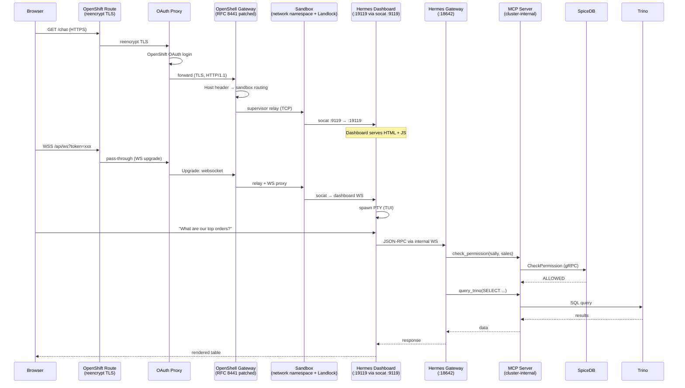
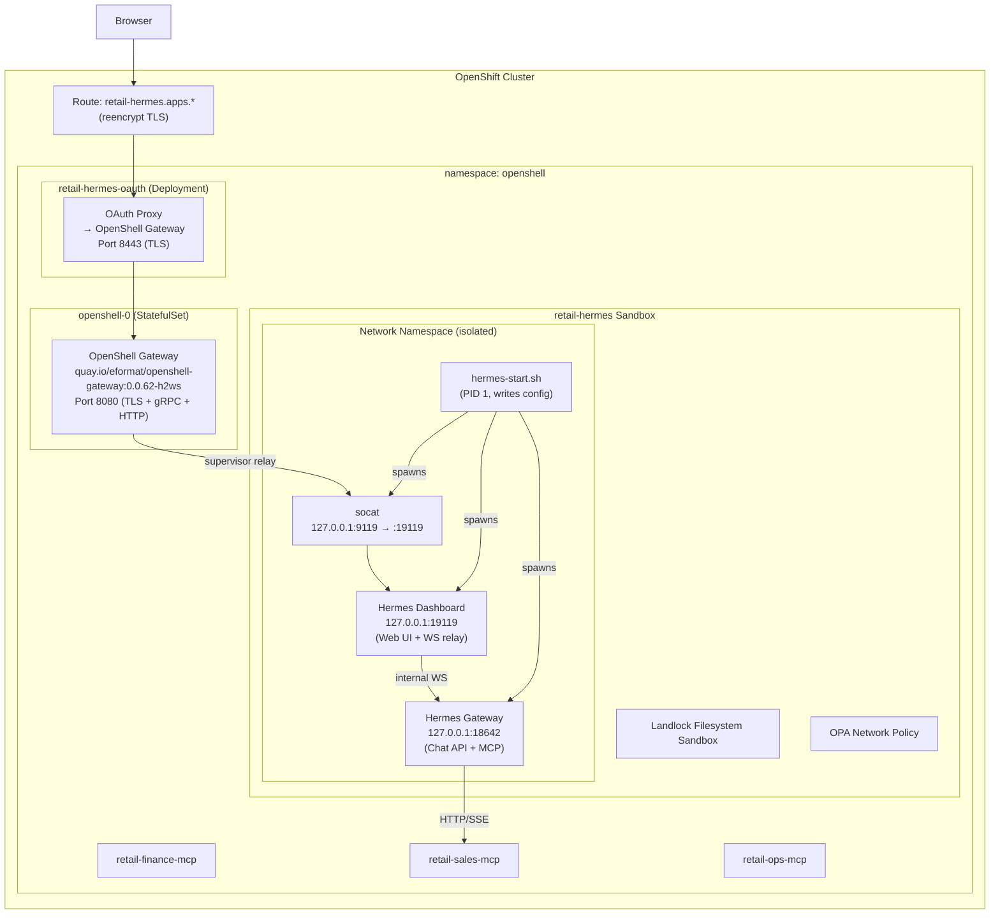
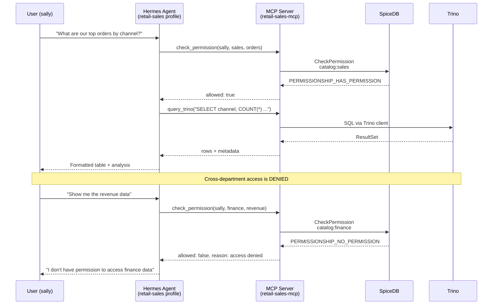
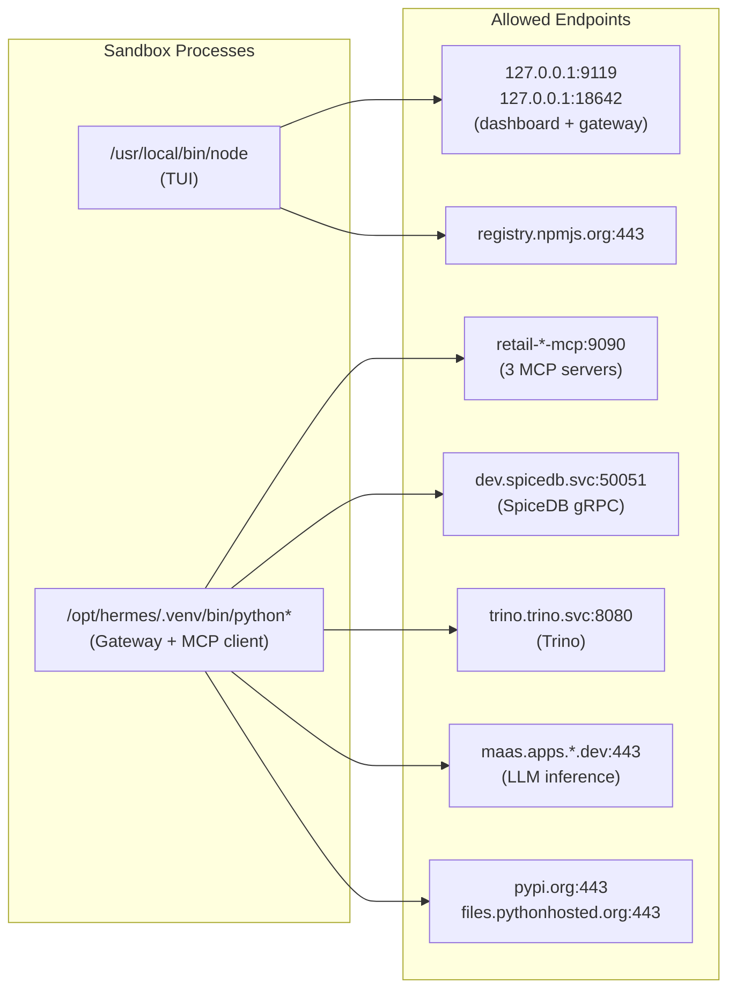

# Retail Enterprise Authorization Demo

Multi-department authorization demo using SpiceDB, three Trino catalogs, and Hermes agent profiles running inside an OpenShell sandbox with Landlock isolation and OPA network policy.

This example validates the SpiceDB platform auth pattern from `docs/spicedb-integration-plan.md`.

## Architecture

### End-to-End Request Flow



### Sandbox Architecture



### Port Layout Inside Sandbox

| Service | Bind Address | Purpose |
|---|---|---|
| Hermes Gateway | `127.0.0.1:18642` | Chat API (`API_SERVER_PORT`) |
| Hermes Dashboard | `127.0.0.1:19119` | Web UI, serves HTML, proxies WebSocket to gateway |
| socat bridge | `127.0.0.1:9119` | OpenShell relay target → forwards to dashboard |

### Authorization Flow



### OPA Network Policy



## Departments & Data

| Department | Catalog | Hermes Profile | User | Tables | Source System |
|---|---|---|---|---|---|
| Finance | `finance.analytics` | `retail-finance` | fred | revenue, expenses, margins, forecasts | SAP S/4HANA |
| Sales | `sales.analytics` | `retail-sales` | sally | orders, pipeline, customers, acquisition_costs | Salesforce |
| Operations | `ops.analytics` | `retail-ops` | alex | inventory, shipments, warehouses, returns | Manhattan WMS |

## Demo Flow

1. Admin creates OpenShift users and groups (`deploy/identity/`)
2. Admin deploys SpiceDB schema and loads fixtures (`deploy/spicedb/load-fixtures.sh`)
3. Admin opens console plugin → Relationships page
4. Admin grants `catalog:finance#reader@user:fred`
5. Fred selects `retail-finance` profile in Hermes → queries revenue → **ALLOWED**
6. Fred tries to query orders (sales catalog) → SpiceDB denies → **DENIED**
7. Admin grants `catalog:sales#reader@user:fred` via console plugin
8. Fred retries orders → **ALLOWED**
9. Admin revokes the cross-department grant → next query → **DENIED**
10. All access visible in console plugin Permission Checker page

## Local Dev Mode (DuckDB)

Run any department's agent locally without Trino or SpiceDB:

```bash
# Prerequisites
python3.12 -m venv venv && source venv/bin/activate
pip install -e ".[all]"
export MODEL_ENDPOINT="http://maas.apps.ocp.cloud.rhai-tmm.dev/prelude-maas/kimi-k2-6/v1"
export MODEL_NAME="kimi-k2-6"
export OPENAI_API_KEY="<your-key>"

# Run each department on a different port
data-agent dev --config examples/retail/finance/agent-config.yaml --port 8181
data-agent dev --config examples/retail/sales/agent-config.yaml --port 8182
data-agent dev --config examples/retail/operations/agent-config.yaml --port 8183
# Login: admin / admin
```

Dev mode uses DuckDB with synthetic data and mock permissions (always-allow). All three department schemas are loaded into every instance.

## Live Mode (Trino + SpiceDB)

```bash
export TRINO_QUERY_HOST=trino.trino.svc.cluster.local
export TRINO_QUERY_PORT=8443
export SPICEDB_ENDPOINT=dev-spicedb.spicedb.svc.cluster.local:50051
export SPICEDB_TOKEN=averysecretpresharedkey

data-agent dev --config examples/retail/finance/agent-config.yaml --port 8181 --trino-live
```

Live mode connects to real Trino and real SpiceDB. Permission checks hit SpiceDB via gRPC.

## Platform Deployment (OpenShell Sandbox)

### Prerequisites

- OpenShift 4.x cluster with OpenShell gateway deployed
- SpiceDB + PostgreSQL in `spicedb` namespace
- Trino + Nessie + MinIO in `trino`/`minio` namespaces
- MCP servers deployed (`deploy/mcp-server/deployment.yaml`)
- OAuth proxy service account with redirect URI annotation
- `openshell` CLI connected to the gateway (`openshell gateway add`)

### 1. OpenShift Users & Groups

```bash
oc create secret generic retail-htpasswd -n openshift-config \
  --from-file=htpasswd=users.htpasswd
oc patch oauth cluster --type=merge --patch-file=deploy/identity/oauth-patch.yaml
oc apply -f deploy/identity/groups.yaml
```

### 2. SpiceDB Schema & Fixtures

```bash
oc apply --server-side -f https://github.com/authzed/spicedb-operator/releases/latest/download/bundle.yaml
oc create ns spicedb
oc apply -k ~/git/mcp-for-public-health/deploy/spicedb/ -n spicedb
./deploy/spicedb/load-fixtures.sh
```

### 3. Trino Lakehouse

```bash
oc create ns trino && oc create ns minio
oc apply -k ~/git/openshift-minio/overlays/cluster-dev
helm install trino ~/git/trino-chart/trino -n trino -f deploy/trino/values.yaml
python deploy/trino/load-data.py  # Load sample data into 3 catalogs
```

### 4. Deploy Hermes Sandbox

```bash
export OPENAI_API_KEY="sk-..."
export OPENSHELL_GATEWAY="your-gateway-name"
./deploy/sandbox/deploy-sandbox.sh
```

The deploy script:
1. Creates the OAuth proxy + Route (reencrypt TLS through OpenShell gateway)
2. Uploads `.env` files with the API key to the sandbox
3. Creates the sandbox from `quay.io/eformat/hermes-openshell:latest`
4. Passes the API key via `env OPENAI_API_KEY=... /usr/local/bin/hermes-start.sh`
5. Waits for Ready status and exposes port 9119
6. Prints the dashboard URL

### Secret Injection

No secrets are baked into the container image. The API key is injected two ways:

1. **Command-line env**: `openshell sandbox create -- env OPENAI_API_KEY=xxx hermes-start.sh` sets it in the process environment
2. **Config rewrite**: `hermes-start.sh` writes `config.yaml` files via heredoc with the key at startup

### Building the Container Image

```bash
# From the repo root
podman build -f examples/retail/deploy/Containerfile.hermes-sandbox \
  -t quay.io/eformat/hermes-openshell:latest .
podman push quay.io/eformat/hermes-openshell:latest
```

The image is based on `nousresearch/hermes-agent:v2026.6.5` with socat, the retail profiles, and `hermes-start.sh` baked in. The API key is NOT in the image.

## SpiceDB Demo Scenarios

Verify the authorization model with the `zed` CLI:

```bash
# 1. Same-department access (ALLOWED)
zed permission check dataset:revenue query user:fred --insecure

# 2. Cross-department deny (DENIED)
zed permission check dataset:orders query user:fred --insecure

# 3. Admin override (ALLOWED)
zed permission check dataset:orders query user:prelude --insecure

# 4. Grant cross-department access
zed relationship create catalog:sales reader user:fred --insecure
zed permission check dataset:orders query user:fred --insecure  # ALLOWED

# 5. Revoke
zed relationship delete catalog:sales reader user:fred --insecure
zed permission check dataset:orders query user:fred --insecure  # DENIED
```

## Troubleshooting

### "Service endpoint is not available"

The sandbox service needs to be exposed after creation:

```bash
openshell service expose retail-hermes 9119 -g $OPENSHELL_GATEWAY
```

This must be re-run after gateway pod restarts. The deploy script includes retry logic, but if interrupted, run manually.

### Chat shows "gateway websocket connection failed"

The TUI (node) process can't reach the dashboard WebSocket. Check OPA denials:

```bash
openshell logs retail-hermes -g $OPENSHELL_GATEWAY 2>&1 | grep DENIED
```

Ensure `policy-retail.yaml` allows `node → 127.0.0.1:9119` and `node → 127.0.0.1:18642`.

### "No API key configured for provider 'custom'"

The API key didn't reach the Hermes config. Verify by checking the raw config:

```bash
TOKEN=$(curl -sk https://<dashboard-url>/ | grep -oP '__HERMES_SESSION_TOKEN__="[^"]+' | cut -d'"' -f2)
curl -sk -H "X-Hermes-Session-Token: $TOKEN" https://<dashboard-url>/api/config/raw | head -6
```

The `api_key:` field should contain the actual key, not `${OPENAI_API_KEY}`.

### MCP tools not appearing in chat

Click **Restart Gateway** in the dashboard sidebar. The gateway needs to reload after MCP server connection to register tools in the agent's session.

## Tests

```bash
pytest tests/test_retail_config.py tests/test_retail_sample_data.py -v
# 24 tests covering config loading, sample data, and queries for all 3 departments
```

## Related

- [SpiceDB Integration Plan](../../docs/spicedb-integration-plan.md)
- [SpiceDB deployment manifests](~/git/mcp-for-public-health/deploy/spicedb/)
- [OpenShell Gateway (patched)](~/git/OpenShell/) — RFC 8441 WebSocket over HTTP/2
- [Hermes Agent](~/git/hermes-agent/)
- [NemoClaw reference](~/git/NemoClaw/agents/hermes/) — sandbox pattern origin
- [Trino chart](~/git/trino-chart)
